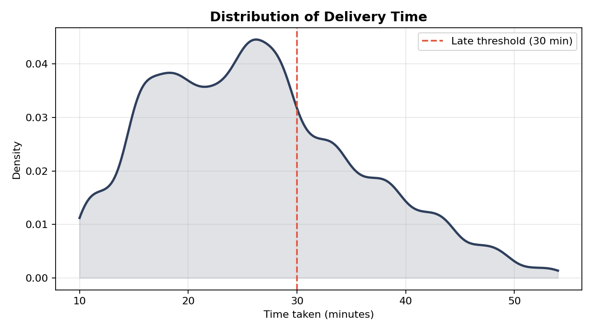
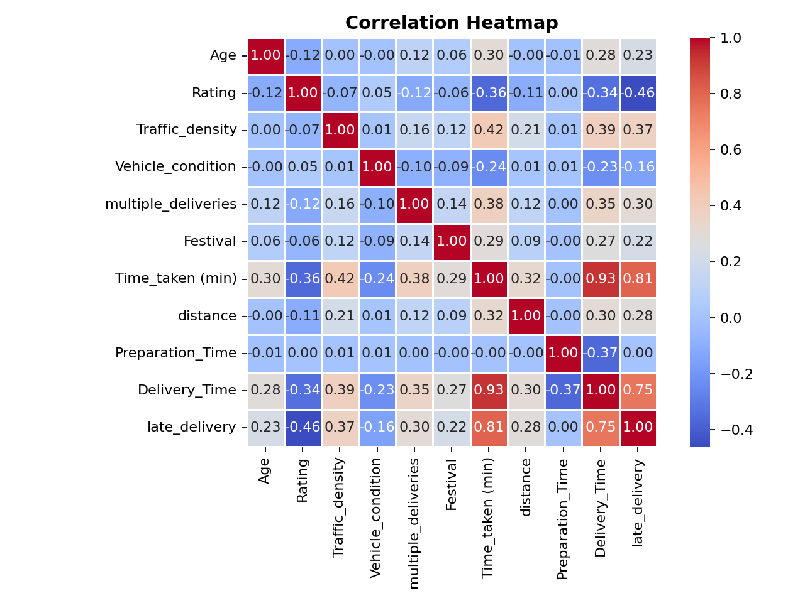
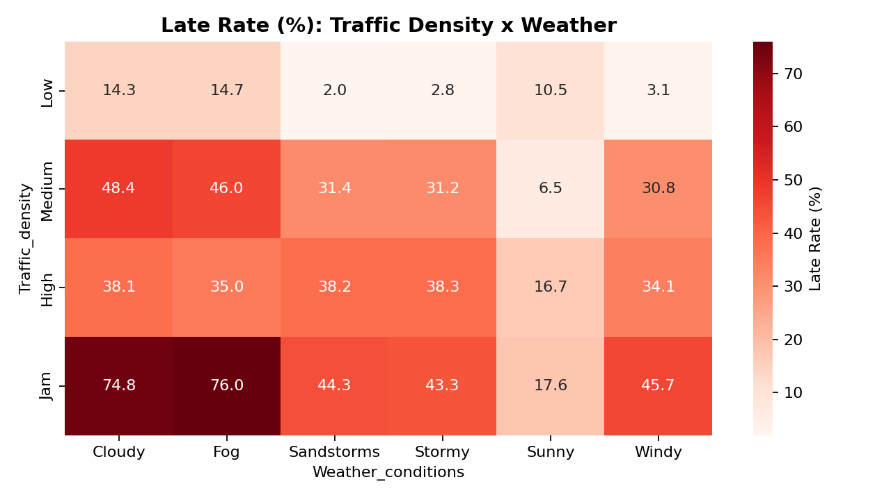
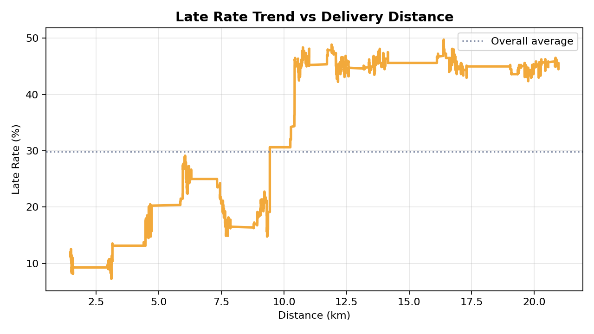
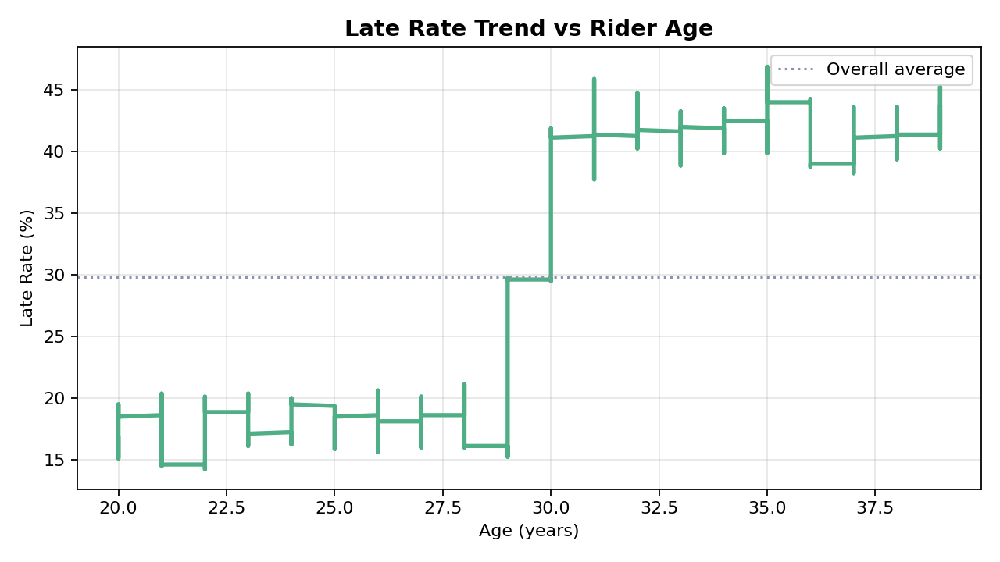
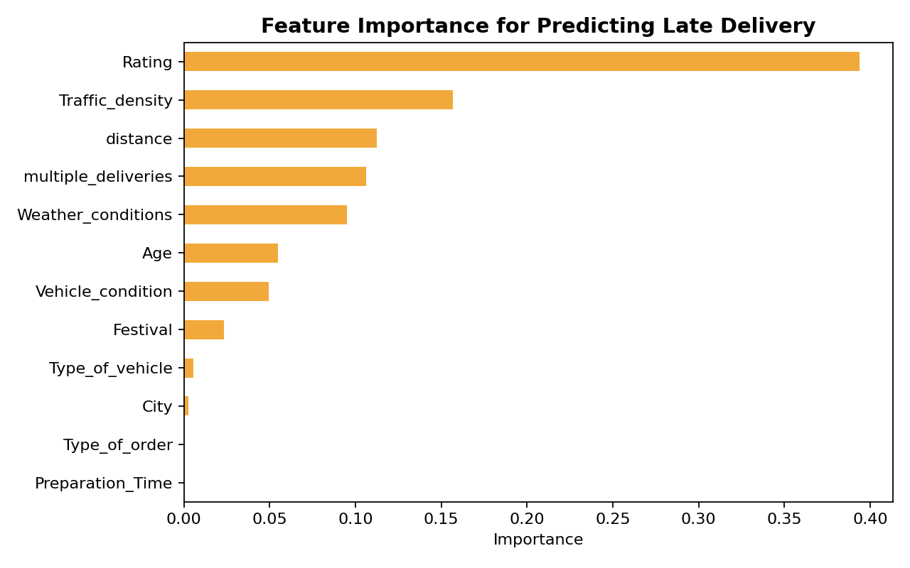
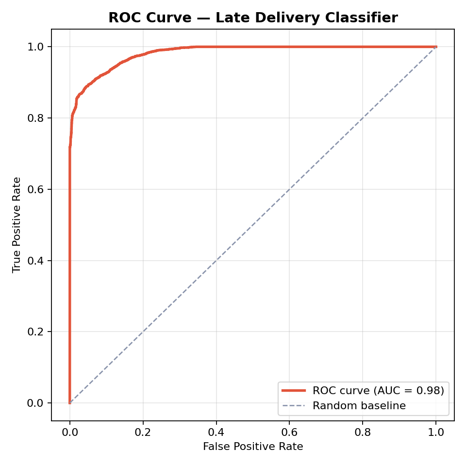
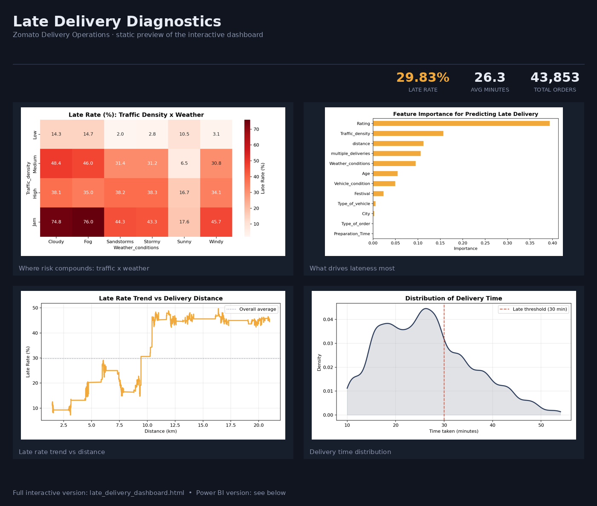

# Food Delivery — Late Delivery Root Cause Analysis

A complete data analysis project investigating **why food delivery orders arrive late**, using the Zomato Delivery Operations Analytics dataset (Kaggle), turned into concrete operational recommendations and two live dashboards (HTML + Power BI).

> **TL;DR:** 29.8% of orders arrive late (>30 min). It's almost entirely a **traffic + distance + order-stacking** problem, compounded by weather — not a kitchen-speed problem. Full breakdown below.

---

## 📌 Objective

Identify the primary drivers of late deliveries and turn those findings into actionable recommendations for delivery operations.

## Dataset

| | |
|---|---|
| **Source** | [Zomato Delivery Operations Analytics Dataset](https://www.kaggle.com/datasets/saurabhbadole/zomato-delivery-operations-analytics-dataset) (Kaggle) |
| **Rows analyzed** | 43,853 |
| **Late threshold** | `Time_taken (min) > 30` |
| **Overall late rate** | 29.8% |
| **Avg delivery time** | 26.3 minutes |

Fields used: rider `Age` & `Rating`, `Weather_conditions`, `Traffic_density`, `Vehicle_condition`, `Type_of_order`, `Type_of_vehicle`, `multiple_deliveries`, `Festival`, `City`, delivery `distance` (Haversine, derived from coordinates), `Preparation_Time` (derived from timestamps), and `Time_taken`.

---

## 🧭 Project Structure

```
food-delivery-delay-analysis/
│
├── data/
│   ├── raw/
│   └── processed/
│
├── notebooks/
│   ├── data_understanding.ipynb
│   ├── data_cleaning.ipynb
│   ├── eda.ipynb
│
├── dashboard/
│   └── powerbi_dashboard.pbix
│
├── reports/
│   └── final_report.pdf
│  
├── images/
│   └── 
│
├── README.md
└── requirements.txt
```

---

## 🔬 Methodology

1. **Data Cleaning** — filled missing values (median for numeric, mode for categorical), computed delivery distance via the Haversine formula, derived preparation time from order/pickup timestamps, encoded categorical fields, dropped irrelevant identifier columns.
2. **Exploratory Analysis** — univariate late-rate comparisons across every driver, bivariate/interaction analysis (traffic × weather, multiple-deliveries × traffic), and continuous trend curves (distance, age) to see effects as smooth relationships rather than fixed buckets.
3. **Model-Based Validation** — a Random Forest classifier trained on all factors together, used to rank feature importance accounting for interactions, and to confirm the identified drivers are genuinely predictive rather than coincidental.

---

## 📊 Key Findings

### Delivery time distribution
Nearly a third of orders fall past the 30-minute mark — the late threshold sits right at the point where the distribution's right tail begins.



### Correlation overview
`Rating` correlates negatively with delivery time; `distance`, `Traffic_density`, and `Age` correlate positively.



### Where risk compounds: traffic × weather
This is the single most important chart in the project. Jam-level traffic combined with Fog/Cloudy weather pushes the late rate to **~75%** — far above the 29.8% baseline — while Low traffic + Sunny stays under 5%.



### Late rate vs. distance
Late rate rises steadily as delivery distance increases, then plateaus around ~45% for longer routes.



### Late rate vs. rider age
A real but much weaker effect than distance or traffic.



### Ranking every driver together
A Random Forest trained on all factors at once — `Rating`, `Traffic_density`, and `distance` dominate; `Preparation_Time` and `Type_of_order` contribute almost nothing.



### Model validation
AUC = 0.98 confirms these drivers are strong, consistent predictors of lateness — not statistical noise. (Accuracy 93.7%, precision 98.0%, recall 80.6%.)



---

## 🏁 Ranked Summary of Causes

| Rank | Driver | Effect |
|---|---|---|
| 1 | Rider rating | Strongest single signal; lower-rated riders → much higher late rates |
| 2 | Traffic density | Jam = 50.6% late vs. Low = 7.9% late (~6-7×) |
| 3 | Delivery distance | Strong effect, compounds sharply with traffic |
| 4 | Order-stacking (2+ simultaneous deliveries) | ~100% late rate once combined with any traffic |
| 5 | Weather (Fog/Cloudy vs Sunny) | Roughly doubles the late rate (~44% vs ~12%) |
| 6 | Vehicle condition / rider age | Moderate effect |
| — | Festival days / Semi-Urban city | Appear extreme (100% late) but rest on very small samples (857 / 156 orders) — low confidence |
| — | Preparation time, order type, vehicle type, city | Negligible effect |

**Bottom line:** lateness is driven by rider workload and road conditions (traffic, distance, order-stacking, weather) — not by kitchen preparation speed.

---

## ✅ Recommendations

| Cause | Recommendation | Why it works |
|---|---|---|
| Order-stacking under traffic | Cap simultaneous deliveries to 1 per rider once traffic is Medium+ | Removes the single worst compounding factor |
| Traffic density | Build traffic-aware ETAs instead of a fixed average promise time | Reduces broken-promise complaints even without speed gains |
| Weather | Auto-extend ETA buffers during Fog/Cloudy; consider incentive pay for bad-weather shifts | Manages expectations and supports retention |
| Distance | Avoid assigning long-distance orders (15km+) to riders already carrying another order | Directly targets the highest-risk order segment |
| Rider rating | Pair new/low-rated riders with shorter, low-traffic routes; investigate what drives low ratings | Rating may be a symptom as much as a cause — needs follow-up |
| Preparation time | Don't prioritize kitchen-speed initiatives to fix lateness | Preparation time has almost no measurable effect |
| Festival days / Semi-Urban | Treat as observations needing more data, not confirmed findings | Both rest on very small sample sizes |

Full detail and supporting evidence for each recommendation is in [`Late_Delivery_Analysis_Report.docx`](Late_Delivery_Analysis_Report.docx).

---

## 📈 Dashboards

### Interactive HTML dashboard
A self-contained dashboard (charts, heatmaps, KPI strip) — no server required, just open the file in a browser.



▶️ **[Open the live dashboard](late_delivery_dashboard.html)** — or enable GitHub Pages on this repo to share it as a link instead of a download.

### Power BI dashboard
<!--
📌 SPACE RESERVED FOR POWER BI SCREENSHOT
Once you've built the dashboard in Power BI Desktop:
1. File > Export > Export as image (or take a screenshot of the report page)
2. Save it as images/09_powerbi_dashboard.png
3. Uncomment the line below and delete this comment block
-->
🔲 *Power BI dashboard screenshot goes here — see build steps below, then add `images/09_powerbi_dashboard.png` and swap in ``.*

**Build steps:**
1. Import [`food_delivery_powerbi_ready.csv`](food_delivery_powerbi_ready.csv) (`Get Data → Text/CSV`) — it already has `Age_Group`, `Distance_Bucket`, `Prep_Time_Bucket`, and readable labels pre-computed.
2. Add measures:
   ```DAX
   Total Orders = COUNTROWS('Data')
   Late Orders  = CALCULATE([Total Orders], 'Data'[late_delivery] = 1)
   Late Rate %  = DIVIDE([Late Orders], [Total Orders])
   Avg Delivery Time = AVERAGE('Data'[Time_taken (min)])
   ```
3. Add 3 Card visuals: Total Orders, Late Rate %, Avg Delivery Time.
4. Matrix visual: rows = `Traffic_density_Label`, columns = `Weather_conditions`, values = `Late Rate %`, with a background color scale (Format → Conditional Formatting) — this is the signature compounding-risk view.
5. Second Matrix: rows = `multiple_deliveries`, columns = `Traffic_density_Label`, same color scale.
6. Clustered bar chart per category driver (`Weather_conditions`, `Traffic_density_Label`, `Vehicle_condition_Label`, `City`, `Age_Group`, `Type_of_order`, `Type_of_vehicle`, `Festival_Label`), sorted descending, with a constant reference line at the overall `Late Rate %`.
7. Two more bar charts: `Distance_Bucket` vs `Late Rate %` and `Prep_Time_Bucket` vs `Late Rate %`, side by side.
8. Slicers for `City`, `Weather_conditions`, `Festival_Label`.
9. A text box or separate page listing the recommendations above.

---

## 🔁 How to Reproduce

1. Open `data_cleaning.ipynb` and run all cells (requires `kagglehub` to pull the raw dataset, or point it at a local copy).
2. Open `EDA_completed.ipynb` and run all cells — regenerates every chart and the feature-importance ranking.
3. Open `late_delivery_dashboard.html` directly in a browser, **or** import `food_delivery_powerbi_ready.csv` into Power BI Desktop and follow the build steps above.

## 🛠️ Tools Used

`pandas` · `numpy` · `matplotlib` · `seaborn` · `scikit-learn` (Random Forest, ROC/AUC) for analysis · Power BI / HTML + Chart.js for dashboards · Word (docx) for the report.

## ⚠️ Limitations

- Festival (857 orders) and Semi-Urban (156 orders) categories are small samples — directional, not conclusive.
- The Random Forest is descriptive (for ranking drivers), not a tuned production model.
- Rating's association with lateness is correlational — causality (does a low rating cause slow delivery, or reflect it?) isn't established here.

## 🔮 Next Steps

- Logistic regression for interpretable odds-ratios.
- Regression on `Time_taken` directly to quantify minutes added per factor (not just late/on-time).
- Live monitoring dashboard in Power BI, refreshed on a schedule.